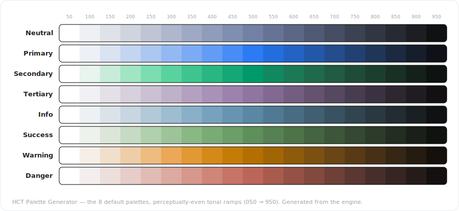

# Color Tokens by NONOUN

[](https://github.com/kimgranlund/nonoun-color-tokens/actions/workflows/ci.yml)
[](https://kimgranlund.github.io/nonoun-color-tokens/)

**▶ [Try it live](https://kimgranlund.github.io/nonoun-color-tokens/)** — the dependency-free,
single-file build, served straight from GitHub Pages. (It's the very same `.html` you get from a
local build; download it and it runs offline from `file://`.)

A perceptual color-palette and **design-token** generator. It builds tonal ramps that are visually
even across their whole range, derives a **37-role semantic layer** (surfaces, on-colors, outlines,
containers, scrims, inverse), and exports to **CSS, Tailwind v4, shadcn/ui, Figma, DTCG, JSON** and
more — plus a one-click `.zip` of everything.

It ships three ways: a **Vite web app**, a single dependency-free **`<nonoun-color-tokens>` web
component**, and a **Figma plugin** that writes the palette straight into the file's variable
collections.

<!-- Hero: regenerate with `npm run gen:preview` (rendered straight from the engine via projectView). -->


> The image above is the tool's **real output** — the eight default palettes rendered straight from
> the engine (no mockup). Note the perceptually-even steps, the in-gamut deep ends, and `Warning`'s
> deliberately lifted light end. Regenerate any time with `npm run gen:preview`.

## What it does

- **Perceptual ramps.** Color is modeled in **HCT / CAM16** and **OKHSL**. Each palette is a tonal
  ramp (050 → 950) with three **distribution modes** — `even` (uniform CIELAB L\*), `perceptual`
  (uniform OKHSL lightness + gamut-proportional chroma, the **default**), and `peak` (anchored to the
  hue's chroma cusp). A **vibrancy** control keeps the palette's mid vivid, `relative-chroma`
  harmonizes saturation across hues, and a chroma floor kills the near-white dead zone.
- **Key colors.** Pin exact brand colors (a `dominant` and optional `supportive`, stored losslessly in
  OKLCH); the ramp is re-derived around them through the perceptual lens, so a palette keeps its real
  source color while every other stop stays even.
- **37-role semantic layer.** From each palette the engine derives the full role set — accents,
  on-colors, surfaces (dim/bright/low/high), outlines, containers, scrims, and inverse — resolved for
  **Light and Dark** in one pass.
- **Gallery + Color Categories.** Keep your own sets under **Your Palettes**, or browse **Color
  Categories** — a curated hub of **7 categories** (Architecture, Cuisine, Film, Literature, Music,
  Nature, Travel), each **12 volumes × 4 = 48** palettes (336 total), sourced from real places, dishes,
  films, biomes… and carrying their story. Open any one as an editable copy. Each category's data is
  lazy-loaded.
- **Exports.** CSS (Hex or **OKLCH**), **Tailwind v4**, **shadcn/ui**, **Figma** variables,
  **Figma UI3** (Material), **DTCG**, **JSON**, a re-importable parametric **Config**, and a
  **Download-all `.zip`** of every format.
- **System / light / dark.** The app chrome and the canvas preview each follow the OS by default
  (sun · moon · system toggles); the chrome dogfoods the very tokens the tool generates.

## Quick start

```bash
npm install
npm run dev        # Vite dev server with HMR (http://localhost:5173)
```

## Build

```bash
npm run build      # gen assets → categories → tsc → vite build (dist/) → offline single-file → figma ui.html
npm run preview    # serve the built dist/
```

`npm run build` produces:
- `dist/` — the Vite-built web app (the color categories are code-split into lazy chunks).
- `dist/nonoun-color-tokens.html` — a dependency-free **offline single-file** build (open it
  directly). This is the artifact published to the [live demo](https://kimgranlund.github.io/nonoun-color-tokens/).
- `figma/plugin/ui.html` — the Figma plugin UI (the bundled app + a postMessage bridge).

## Test

```bash
npm test           # regenerates the build artifacts, then runs every verifier + the headless DOM boot
```

The test suite is the real coverage — pure-`node` verifiers per layer (engine round-trips, tonal-curve
fidelity, the OKHSL ↔ sRGB module, the 37-role table vs. the canonical answer key, the export formats,
the Figma raw→semantic cascade, persistence round-trip) plus a DOM-shim boot
(`test/ui/headless-boot.mjs`) that drives the real `app.js` — gallery, color categories, editor, exports —
without a browser.

## Layout

```
src/
  engine/   hct.js · okhsl.js · tonal.js · semantic.js · exports.js   — pure ES modules, no DOM
  ui/       app.js · model.mjs · persist.js · styles.css · icons.js · zip.mjs
            categories/     index.js + one lazy module per category (generated)
            figma-plugin-assets.js
  main.ts   — Vite entry (imports the stylesheet + <nonoun-color-tokens>, mounts it)
figma/
  plugin/   code.js · manifest.json · ui.html              — the generator AS a Figma plugin
  binder/   bind-plan.mjs · figma-semantic-binder/          — the standalone Semantic Binder plugin
scripts/    bundle.mjs · gen-categories.mjs · gen-figma-ui.mjs · gen-figma-assets.mjs · gen-preview.mjs
docs/spec/  the product specification, the canonical data/role-table.json (the answer key),
            and colors/categories/*.json (the color-category source data gen-categories reads)
test/       engine/ · ui/ · figma/ · run.mjs
```

The engine is pure and DOM-free; `src/ui/app.js` defines the `<nonoun-color-tokens>` web component over
it; the Figma plugin reuses the exact same bundle. `docs/spec/data/role-table.json` is the **canonical
contract** the semantic / export / figma verifiers validate against — it is the spec, not a derived
file. The Color Categories are generated from `docs/spec/colors/categories/*.json` by
`npm run gen:categories` (into `src/ui/categories/`).

## Figma plugin

Two plugins live under `figma/`:

- **`figma/plugin/`** — the generator itself, running inside Figma. In Figma: *Plugins → Development →
  Import plugin from manifest…* and pick `figma/plugin/manifest.json`. Its **Add Variables → Figma**
  action writes a **`Color Primitives`** collection (the raw colors) + a **`Color Modes`** collection
  (the semantic Light/Dark tokens, aliased to the primitives) and embeds the parametric config in the
  file (`root pluginData`) for a lossless round-trip.
- **`figma/binder/`** — the standalone **Semantic Binder** (`figma/binder/figma-semantic-binder/`),
  which aliases each semantic role to its raw variable so editing a raw color cascades live.

## License

MIT — see [LICENSE](LICENSE).
