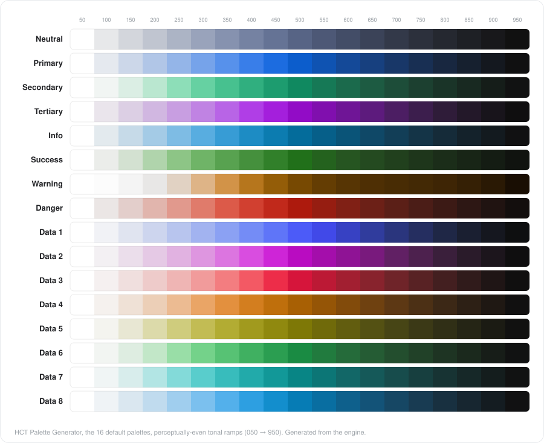

# Ultimate Tokens

[](https://github.com/kimgranlund/ultimate-tokens/actions/workflows/ci.yml)
[](https://kimgranlund.github.io/ultimate-tokens/)

**▶ [Try it live](https://kimgranlund.github.io/ultimate-tokens/)**: the dependency-free,
single-file build, served straight from GitHub Pages. (It's the very same `.html` you get from a
local build; download it and it runs offline from `file://`.)

A perceptual color-palette and **design-token** generator. It builds tonal ramps that are visually
even across their whole range, derives a **53-role semantic layer** (surfaces, on-colors, outlines,
containers, scrims, inverse), and exports to **CSS, Tailwind v4, shadcn/ui, Panda CSS, Radix, Figma,
DTCG, JSON, Claude Design** and more, plus a one-click `.zip` of everything.

It ships three ways: a **Vite web app**, a single dependency-free **`<ultimate-tokens>` web
component**, and a **Figma plugin** that writes the palette straight into the file's variable
collections.

<!-- Hero: regenerate with `npm run gen:preview`, rendered straight from the engine (projectView) in the PERCEPTUAL distribution. -->


> The image above is the tool's **real output**, the 16 default palettes (8 brand families + 8
> data palettes) in the **perceptual** distribution, rendered straight from the engine (no mockup):
> perceptually-even steps, in-gamut deep ends, and `Warning`'s deliberately lifted light end.
> Regenerate any time with `npm run gen:preview`.

## What it does

- **Perceptual ramps.** Color is modeled in **HCT / CAM16** and **OKHSL**. Each palette is a tonal
  ramp (050 → 950) with three **distribution modes**, `even` (uniform CIELAB L\*), `perceptual`
  (uniform OKHSL lightness + gamut-proportional chroma, the **default**), and `peak` (anchored to the
  hue's chroma cusp). A **vibrancy** control keeps the palette's mid vivid, `relative-chroma`
  harmonizes saturation across hues, and a chroma floor kills the near-white dead zone. Each palette's
  **Base chroma** mutes its whole ramp evenly, times a global **Base chroma** factor, and every palette
  carries a **prime system**: seven swatches (brightest → dimmest) on their own lightness ladder around
  the palette's key color, scaled by one global **Prime chroma** factor, drawn as the strip ahead of
  each ramp row and exported as their own `prime` token group. Both global factors default to 100, where
  a sampled palette's own colour is emitted exactly.
- **Key colors.** Pin exact brand colors (a `dominant` and optional `supportive`, stored losslessly in
  OKLCH); the ramp is re-derived around them through the perceptual lens, so a palette keeps its real
  source color while every other stop stays even.
- **Compose new palettes.** Derive a new palette from the ones you already have, a **Relative**
  color-theory relationship (extend / complement / contrast / bridge / anchor / recontextualize, pivoting
  on your primary), an **Environmental** neutral (the set's chroma-weighted-mean hue at a restrained
  chroma), or a **Custom** pick (a native color picker, or hue + chroma), with a hue × chroma plot and a
  live ramp preview before you commit. Drag palettes by their handle to reorder.
- **53-role semantic layer.** From each palette the engine derives the full role set, accents,
  on-colors, surfaces (dim/bright/low/high), outlines, containers, scrims, and inverse, resolved for
  **Light and Dark** in one pass.
- **Gallery + Color Categories.** Keep your own sets under **Your Palettes**, or browse **Color
  Categories**, a curated hub of **7 categories** (Architecture, Cuisine, Film, Literature, Music,
  Nature, Travel), each **12 volumes × 4 = 48** palettes (336 total), sourced from real places, dishes,
  films, biomes… and carrying their story. Open any one as an editable copy. Each category's data is
  lazy-loaded.
- **Exports.** CSS (Hex or **OKLCH**), **Tailwind v4**, **shadcn/ui**, **Panda CSS**, **Radix**,
  **Figma** variables, **Figma UI3** (Material, interchange-only, not a native Figma format), **DTCG**, **JSON**, a **design-system export** (`DESIGN.md` +
  `tokens.json` + preview cards, in a target each for Claude (`claude.ai/design` and Claude Code),
  Google Stitch, and Figma Make to generate on-brand UI), a re-importable parametric
  **Config**, and a **Download-all `.zip`**. An **Include** toggle row picks which token systems, **Color · Typography ·
  Geometry**, ride the Download-All `.zip` and the Brand-Kit MCP.
- **Typography.** The type analog of the color engine, a few params → a **systematic type scale** of
  fifteen voices (Display · Headline · Sub-heading · Title · Sub-title · Lead · Body · Body-mono · Label ·
  Label-mono · Kicker · Tiny · Tiny-mono · UI-control · UI-widget), with derived size (modular scale), optical
  letter-spacing, leading, and weight. Pick a **treatment** (Product, Luxury, Editorial, Technical,
  Brutalist), preview a live specimen, export **CSS + DTCG** type tokens.
- **Geometry.** The spatial analog, a few axes → the **Maison ladder**: 27 control cells (tier Content ·
  Product · Micro × scale sm · md · lg × size sm · md · lg), each with 16 derived fields on one
  **centering law** (inset = (height − icon) / 2; the icon-only square, the chip sizes, the compound
  container insets, and the radii all fall out of it). Pick a **radius mode** (Default, Round, Sharp,
  Pill), preview the live ladder, export **CSS + DTCG** `dimension` tokens.
- **Brand-Kit MCP.** Download a **zero-dependency MCP server** pre-filled with your tokens, point
  **Claude Code / Cursor / any MCP agent** at it (`node brand-kit-server.mjs`) and it serves the
  **systems you opted in** (palettes, ramps + the 53-role semantic layer in light + dark; the typography
  scale; the geometry scale) so the agent builds with your exact tokens. See `mcp/`.
- **System / light / dark.** The app chrome follows the OS by default (sun · moon · system toggle) and
  dogfoods the very tokens the tool generates. The canvas always shows Light and Dark side by side.

## Quick start

```bash
npm install
npm run dev        # Vite dev server with HMR (http://localhost:5173)
```

## Build

```bash
npm run build      # gen assets → categories → tsc → vite build (dist/) → offline single-file → figma ui.html
npm run preview    # serve the built dist/
```

`npm run build` produces:
- `dist/`: the Vite-built web app (the color categories are code-split into lazy chunks).
- `dist/ultimate-tokens.html`: a dependency-free **offline single-file** build (open it
  directly). This is the artifact published to the [live demo](https://kimgranlund.github.io/ultimate-tokens/).
- `figma/plugin/ui.html`: the Figma plugin UI (the bundled app + a postMessage bridge).

## Test

```bash
npm test           # regenerates the build artifacts, then runs every verifier + the headless DOM boot
```

The test suite is the real coverage, pure-`node` verifiers per layer (engine round-trips, tonal-curve
fidelity, the OKHSL ↔ sRGB module, the 53-role table vs. the canonical answer key, the export formats,
the Figma raw→semantic cascade, persistence round-trip) plus a DOM-shim boot
(`test/ui/headless-boot.mjs`) that drives the real `app.js`, gallery, color categories, editor, exports,
without a browser.

## Layout

```
src/
  engine/   hct.js · okhsl.js · tonal.js · semantic.js · exports.js, pure ES modules, no DOM
  ui/       app.js · model.mjs · persist.js · styles.css · icons.js · zip.mjs
            categories/     index.js + one lazy module per category (generated)
            figma-plugin-assets.js
  main.ts, Vite entry (imports the stylesheet + <ultimate-tokens>, mounts it)
figma/
  plugin/   code.js · manifest.json · ui.html, the generator AS a Figma plugin
  binder/   bind-plan.mjs · figma-semantic-binder/, the standalone Semantic Binder plugin
scripts/    bundle.mjs · gen-categories.mjs · gen-figma-ui.mjs · gen-figma-assets.mjs · gen-preview.mjs ·
            gen-font-test.mjs
docs/reference/  runtime-read data only: the canonical data/role-table.json (the answer key),
            and colors/categories/*.json (the color-category source data gen-categories reads)
test/       engine/ · ui/ · figma/ · run.mjs
```

The engine is pure and DOM-free; `src/ui/app.js` defines the `<ultimate-tokens>` web component over
it; the Figma plugin reuses the exact same bundle. `docs/reference/data/role-table.json` is the **canonical
contract** the semantic / export / figma verifiers validate against, it is the spec, not a derived
file. The Color Categories are generated from `docs/reference/colors/categories/*.json` by
`npm run gen:categories` (into `src/ui/categories/`).

## Figma plugin

Two plugins live under `figma/`:

- **`figma/plugin/`**: the generator itself, running inside Figma. In Figma: *Plugins → Development →
  Import plugin from manifest…* and pick `figma/plugin/manifest.json`. Its **Add Variables → Figma**
  action writes a **`Color Primitives`** collection (the raw colors) + a **`Color Roles`** collection
  (the semantic Light/Dark tokens, aliased to the primitives) and embeds the parametric config in the
  file (`root pluginData`) for a lossless round-trip.
- **`figma/binder/`**: the standalone **Semantic Binder** (`figma/binder/figma-semantic-binder/`),
  which aliases each semantic role to its raw variable so editing a raw color cascades live.

## Views and sections

The app starts in a gallery; opening a set enters one editor with three sections.

**Gallery.** The home hub shows your saved palette sets as tiles under a search box, then the curated
color categories as a grid. Opening a category lists its volumes of presets, searchable within that
category, and clicking a preset opens an editable copy in your own sets. **Project** (load the saved
config), **Import** (a config `.json`) and **+ New** sit in the header. Detail: `docs/specs/app-shell.md`.

**Color.** The canvas shows Palettes (the ramps), Scrims, Mapping (the semantic-role table) or Radix
(the 12-step ladder). Every canvas draws Light and Dark side by side, except Mapping, whose table already
shows both; Typography and Geometry do the same, and **Compare** adds a pair per breakpoint. The left pane holds palette analysis
cards; the right pane is the inspector. Detail: `docs/references/ui-plan.md` (Revision B).

**Typography.** The canvas is a Specimen (each step in its real face) or a Tokens matrix (Base plus each
breakpoint). Breakpoint modes sit beside it, Tablet and Mobile by default, and an **All** button shows
every breakpoint side by side and hides the Specimen/Tokens switch. The inspector has Scale, Fonts and
Specimen tabs; the left pane holds the type analysis cards.

**Geometry.** The canvas is Controls (a live mock control for each of the 27 ladder cells) or a Tokens
matrix (every cell by its 16 fields), with the same breakpoint modes and All button. The inspector has
Ladder, Radius and Space tabs, and every cell's text size composes from the Type scale's UI text table.
The left pane holds the geometry analysis cards.

**Export drawer.** Five groups: Colors (ten formats), Typography (CSS, DTCG), Geometry (CSS, CSS sizes
only, DTCG), Design System (`tokens.json`, `DESIGN.md`) and Project (Config).

## License

MIT, see [LICENSE](LICENSE).
